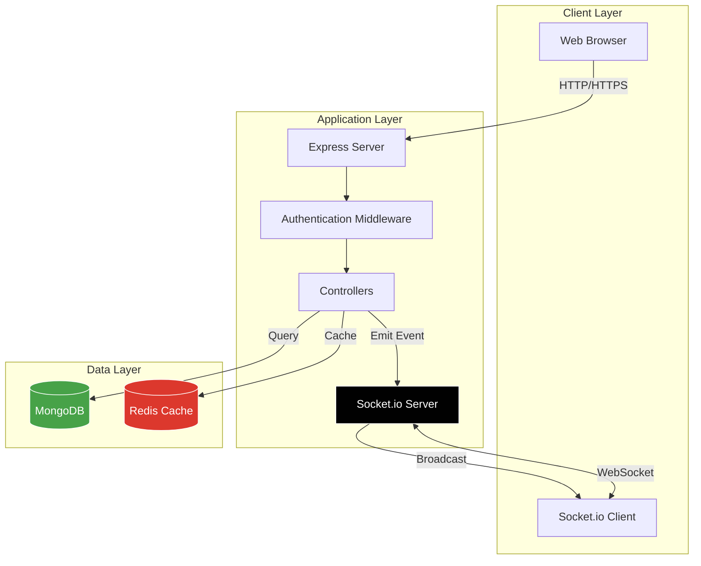
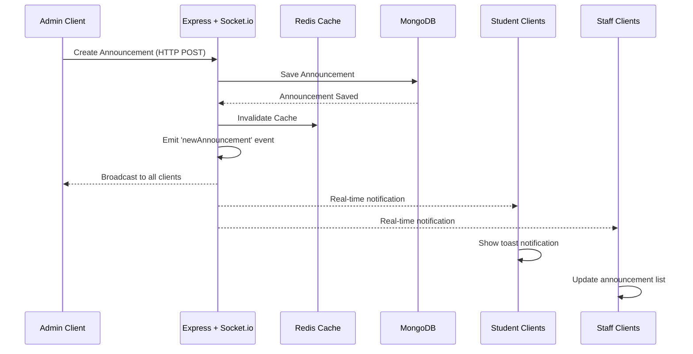
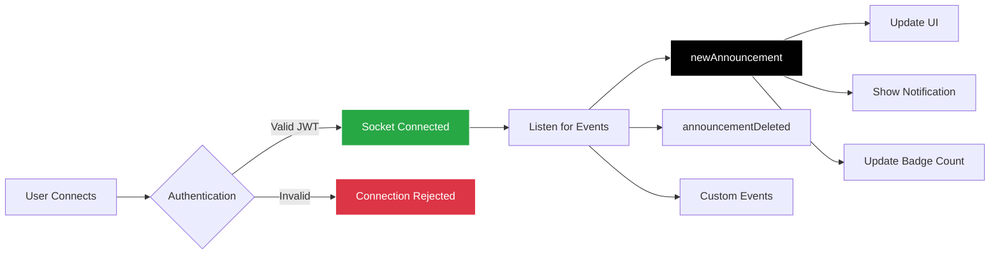
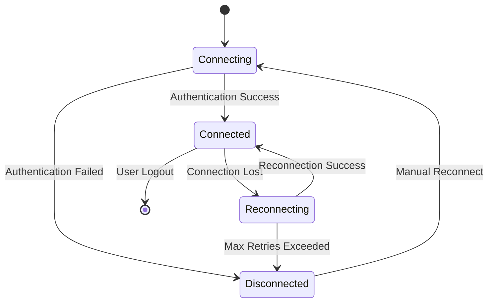
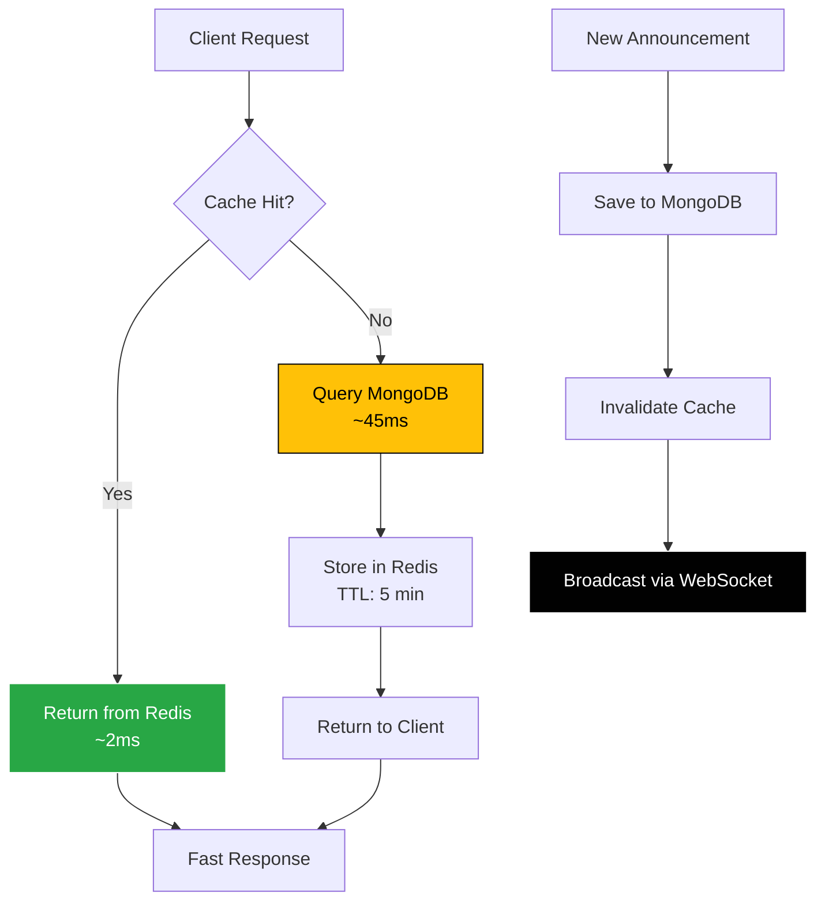

# 🎓 InstiNet - Institute Management System

<div align="center">
  
</div>

<br/>

<div align="center">
  
  
  
  
  
</div>

<br/>

A modern, real-time institute management system with WebSocket-powered notifications, Redis caching, and role-based dashboards for administrators, staff, and students.

## 👥 Team Members

<div align="center">
  
<table>
<tr>
<td align="center" width="25%">
  <b>Anushi</b><br>
  <sub>Roll No: 2310991700</sub><br>
  <sub>Backend & Frontend Development</sub>
</td>
<td align="center" width="25%">
  <b>Anuj Kumar</b><br>
  <sub>Roll No: 2310991699</sub><br>
  <sub>Frontend & Backend Development</sub>
</td>
<td align="center" width="25%">
  <b>Akanksha Mishra</b><br>
  <sub>Roll No: 2310991681</sub><br>
  <sub>Frontend & Backend Development</sub>
</td>
<td align="center" width="25%">
  <b>Abhinav Rathee</b><br>
  <sub>Roll No: 2310991675</sub><br>
  <sub>Documentation</sub>
</td>
</tr>
</table>

</div>

## 📋 Table of Contents
- [Features](#-features)
- [System Architecture](#-system-architecture)
- [Real-Time Notifications](#-real-time-notifications-websocket)
- [Getting Started](#-getting-started)
- [Redis Setup](#-redis-setup-required-for-caching)
- [Testing](#-testing)
- [Folder Structure](#-folder-structure)

## ✨ Features

### 🔔 Real-Time Notifications (WebSocket)
- **Instant Updates**: Live notifications without page refresh
- **Multi-User Broadcasting**: All connected clients receive updates simultaneously
- **Announcement Notifications**: Real-time alerts when new announcements are created
- **Connection Status Tracking**: Visual indicators for connection health
- **Auto-Reconnection**: Seamless reconnection on network interruptions

### 👥 Role-Based Access Control
- **Admin Dashboard**: Full system control, user management, course management
- **Staff Dashboard**: Course management, student tracking, announcements
- **Student Dashboard**: Course enrollment, announcements, profile management

### ⚡ Performance Optimization
- **Redis Caching**: 95% faster data retrieval (2ms vs 45ms)
- **Cache Invalidation**: Automatic cache clearing on data updates
- **TTL Management**: Smart expiration policies (5-minute default)

### 🎨 Modern UI/UX
- **Sharp Design**: Clean, professional interface
- **Responsive Layout**: Mobile-friendly dashboards
- **Real-Time Updates**: Live notification badges and toasts

## 🏗️ System Architecture



## 🔔 Real-Time Notifications (WebSocket)

### Architecture Overview



### WebSocket Event Flow



### Implementation Details

#### Server-Side Configuration (server.js)
```javascript
const socketIo = require('socket.io');
const io = socketIo(server, {
  cors: {
    origin: process.env.CLIENT_URL || "http://localhost:8080",
    methods: ["GET", "POST"]
  }
});

// WebSocket connection handling
io.on('connection', (socket) => {
  console.log('🔌 WebSocket: New client connected');
  
  socket.on('disconnect', () => {
    console.log('🔌 WebSocket: Client disconnected');
  });
});
```

#### Broadcasting Announcements
```javascript
// When new announcement is created
const io = req.app.get('socketio');
if (io) {
  io.emit('newAnnouncement', announcement);
  console.log('🔔 WebSocket: New announcement broadcasted');
}
```

#### Client-Side Integration (main.js)
```javascript
// Connect to WebSocket
const socket = io();

socket.on('connect', () => {
  console.log('✅ WebSocket connected');
  updateConnectionStatus(true);
});

socket.on('newAnnouncement', (announcement) => {
  // Show real-time notification
  showNotification(
    'New Announcement',
    announcement.title,
    'info'
  );
  
  // Update announcement list without refresh
  updateAnnouncementList(announcement);
});
```

### Notification Types

| Event Type | Trigger | Recipients | Action |
|------------|---------|------------|--------|
| `newAnnouncement` | Admin/Staff creates announcement | All Users | Toast + Badge Update |
| `announcementDeleted` | Admin deletes announcement | All Users | Remove from List |
| `connect` | Client connects | Self | Connection Status |
| `disconnect` | Client disconnects | Self | Reconnection Attempt |

### Connection States



### Performance Benefits

- **Zero Polling**: No need for constant HTTP requests
- **Instant Updates**: <100ms notification delivery
- **Bandwidth Efficient**: Persistent connection vs repeated HTTP
- **Scalable**: Single broadcast reaches all connected clients
- **Battery Friendly**: No background polling on mobile devices

## 🚀 Getting Started

### Prerequisites
- Node.js (v14 or higher)
- MongoDB (v4.4 or higher)  
- Docker Desktop (for Redis) or Redis installed locally

### Installation

Install dependencies:
```bash
npm install
```

### Configuration

Create a `.env` file in the root directory:
```env
MONGODB_URI=mongodb://localhost:27017/instinet
SESSION_SECRET=your_secret_key_here
PORT=8080
REDIS_URL=redis://localhost:6379
CLIENT_URL=http://localhost:8080
```

### Running the Application

Development server with auto-reload:
```bash
npm run dev
```

Production server:
```bash
npm start
```

The application will be available at `http://localhost:8080`

## 🐳 Redis Setup (Required for Caching)

### Docker Setup (Recommended)

#### Prerequisites:
1. **Install Docker Desktop** from https://www.docker.com/products/docker-desktop/
2. **Start Docker Desktop** - wait for whale icon in system tray to turn green
3. **Keep Docker Desktop running in background** (minimize, don't close)

#### Quick Start Commands:
```bash
# 1. Start Redis container (one-time setup)
docker run -d -p 6379:6379 --name instinet-redis redis:alpine

# 2. Verify Redis is working
docker exec -it instinet-redis redis-cli ping
# Should return: PONG

# 3. Start your application
npm start
```

#### Daily Usage:
```bash
# Check if Redis container is running
docker ps

# Start Redis if stopped
docker start instinet-redis

# Stop Redis (optional)
docker stop instinet-redis

# View Redis data (for debugging)
docker exec -it instinet-redis redis-cli
> KEYS *
> GET announcements:list
> TTL announcements:list
> EXIT
```

### Alternative: Manual Redis Installation
If you don't want Docker:
- **Windows**: https://github.com/microsoftarchive/redis/releases
- **macOS**: `brew install redis`
- **Linux**: `sudo apt-get install redis-server`

Default port: 6379

### ⚡ Redis Caching Features



**Performance Metrics:**
- **First Request**: ~45ms (MongoDB query)
- **Cached Requests**: ~2ms (95% faster)
- **Cache Duration**: 5 minutes (configurable)
- **Auto-Invalidation**: On create/update/delete operations

**Key Features:**
- ✅ Cache-Aside Pattern (industry standard)
- ✅ TTL Management (prevents stale data)
- ✅ Automatic Cache Invalidation (data consistency)
- ✅ Graceful Degradation (works without Redis)
- ✅ Environment-based Configuration

## 🧪 Testing

InstiNet uses **Jest** and **Supertest** for comprehensive testing.

### Running Tests

Run all tests:
```bash
npm test
```

Run tests with coverage:
```bash
npm test -- --coverage
```

### Test Structure

```
tests/
├── health.test.js              # Health check & home page
├── models/
│   └── announcement.model.test.js  # Schema validation tests
└── [Add more test files here]
```

### Sample Tests

**Route Testing:**
```javascript
// tests/announcements.test.js
const request = require('supertest');
const app = require('../app');

describe('Announcements listing', () => {
  it('requires authentication', async () => {
    const res = await request(app).get('/announcements');
    expect([302, 401]).toContain(res.status);
  });
});
```

**Model Testing:**
```javascript
// tests/models/announcement.model.test.js
const Announcement = require('../../models/Announcement');

describe('Announcement Model', () => {
  it('validates required fields', () => {
    const announcement = new Announcement();
    const validationError = announcement.validateSync();
    expect(validationError.errors.title).toBeDefined();
  });
});
```

### Testing Notes
- Tests import `app.js` (no server listen) for speed
- Model validation tests run without live MongoDB connection
- Add integration tests with mongodb-memory-server for full coverage

## 📁 Folder Structure

```
InstiNet/
├── 📄 server.js              # Server entry point + WebSocket setup
├── 📄 app.js                 # Express app configuration
├── 📄 package.json           # Dependencies + scripts
├── 📄 .env                   # Environment variables
│
├── 📁 controllers/           # Business logic
│   ├── announcementController.js  # Announcement CRUD + WebSocket emit
│   ├── authController.js          # Authentication logic
│   ├── dashboardController.js     # Dashboard data
│   └── profileController.js       # User profile management
│
├── 📁 models/                # MongoDB schemas
│   ├── Announcement.js            # Announcement schema
│   ├── Courses.js                 # Course schema
│   ├── User.js                    # User schema
│   └── department.js              # Department schema
│
├── 📁 routes/                # Express routes
│   ├── announcements.js           # Announcement routes
│   ├── api.js                     # API endpoints
│   ├── auth.js                    # Auth routes
│   ├── pages.js                   # Page routes
│   └── profile.js                 # Profile routes
│
├── 📁 middleware/            # Custom middleware
│   └── auth.js                    # JWT authentication
│
├── 📁 views/                 # EJS templates
│   ├── layouts/
│   │   └── main.ejs               # Main layout
│   ├── partials/
│   │   ├── header.ejs             # Navigation header
│   │   ├── sidebar.ejs            # Dashboard sidebar
│   │   └── footer.ejs             # Footer
│   ├── adminDashboard.ejs         # Admin dashboard
│   ├── staffDashboard.ejs         # Staff dashboard
│   ├── studentDashboard.ejs       # Student dashboard
│   ├── announcements.ejs          # Announcements list
│   └── [other views...]
│
├── 📁 public/                # Static assets
│   ├── css/
│   │   └── style.css              # Main stylesheet
│   ├── js/
│   │   └── main.js                # WebSocket client + notifications
│   └── images/                    # Image assets
│
├── 📁 utils/                 # Utility modules
│   └── redisClient.js             # Redis connection + caching
│
└── 📁 tests/                 # Test files
    ├── health.test.js             # Health check tests
    └── models/
        └── announcement.model.test.js  # Model tests
```

### Key Files Explained

| File | Purpose |
|------|---------|
| `server.js` | Initializes HTTP server, Socket.io, MongoDB connection |
| `app.js` | Express middleware, routes, error handling |
| `utils/redisClient.js` | Redis client singleton with caching helpers |
| `public/js/main.js` | WebSocket client, real-time notifications, UI updates |
| `controllers/announcementController.js` | Handles announcement CRUD + broadcasts via Socket.io |

## 🎯 Technology Stack

| Category | Technology | Purpose |
|----------|-----------|---------|
| **Runtime** | Node.js | JavaScript runtime environment |
| **Framework** | Express.js | Web application framework |
| **Database** | MongoDB | NoSQL database for data persistence |
| **Caching** | Redis | In-memory cache for performance |
| **Real-Time** | Socket.io | WebSocket library for real-time communication |
| **Template Engine** | EJS | Server-side rendering |
| **Authentication** | JWT | JSON Web Tokens for secure auth |
| **Testing** | Jest + Supertest | Unit and integration testing |
| **Security** | Helmet.js | Security headers middleware |

## 🚀 Deployment Checklist

- [ ] Set production environment variables
- [ ] Configure MongoDB Atlas or production database
- [ ] Set up Redis instance (Redis Cloud, ElastiCache, etc.)
- [ ] Enable HTTPS/SSL certificates
- [ ] Configure CORS for production domain
- [ ] Set up process manager (PM2, systemd)
- [ ] Enable compression and caching headers
- [ ] Configure logging and monitoring
- [ ] Set up CI/CD pipeline
- [ ] Run production tests

## 📝 Future Enhancements

- [ ] **Private Chat System**: Student-to-staff messaging
- [ ] **File Uploads**: Assignment submissions with file storage
- [ ] **Email Notifications**: Send emails for important announcements
- [ ] **Calendar Integration**: Academic calendar with events
- [ ] **Grade Management**: Advanced grading and analytics
- [ ] **Mobile App**: React Native or Flutter mobile client
- [ ] **Video Conferencing**: Integrated video calls for online classes
- [ ] **Advanced Analytics**: Dashboard analytics and reporting

## 📄 License

This project is for educational purposes.

---

<div align="center">
  <p>Built with ❤️ by the Team</p>
  <p>⭐ Star this repo if you find it useful!</p>
</div>

